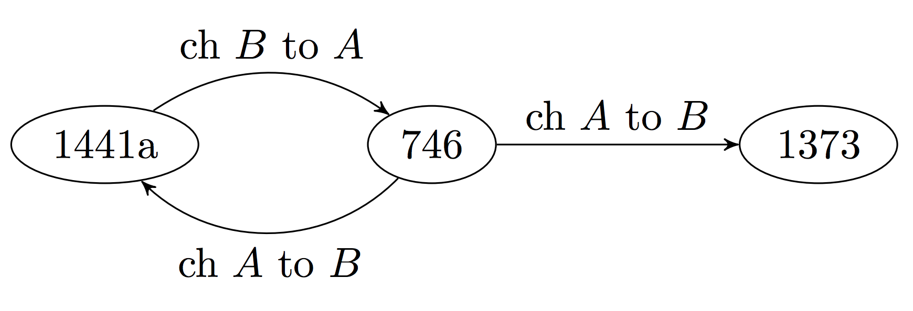

# dAIrector: Automatic Story Beat Generation through Knowledge Synthesis

dAIrector is an automated director which collaborates with humans storytellers.

The system is based on work by Markus Eger [Plotter: Operationalizing the Master Book of All Plots](https://pdfs.semanticscholar.org/0c13/49ba53a155ca90dc6efe8ca3fe620fb50f88.pdf) and Kory Mathewson [Improvised Theatre Alongside Artificial Intelligences](https://aaai.org/ocs/index.php/AIIDE/AIIDE17/paper/view/15825).

This code accompanies the paper: [dAIrector: Automatic Story Beat Generation through Knowledge Synthesis](https://arxiv.org/abs/1811.03423) presented at Joint Workshop on Intelligent Narrative Technologies and Intelligent Cinematography and Editing at AAAI Conference on Artificial Intelligence and Interactive Digital Entertainment (AIIDE'18). Edmonton, Alberta, Canada.

## Background
Through the collaboration of humand and machine, complex stories can be constructed. While generating plots automatically is interesting, I think that the humans can work to justify and contextualize those plots, to poke fun and evaluate, and to be inspired by the system. Improvisational theatre is an extemporaneous form of theatre where there is no rehearsal and the script is not prepared ahead of time. The art depends on entropy and the justification of the randomness.

dAIrector is used to create stories. These stories are represented as linked clauses.

The human performers use their knowledge of general story shapes, as summarized in the following figure:
.

## Example Usage

Briefly, the system works as follows:

1. Several Plotto plots are generated (using A, B and C clauses), perhaps only using a subset of plotto fragments, with annotations which could require more context, and perhaps including different branches/endings.
2. Actors are on stage and get one of these plots:
a. The actors are given the next scene in sequence. If a scene comes up that is annotated, a relevant/the most relevant entry from the TV Tropes tropes we have is brought out to guide the scene.
b. Depending on the actions of the actors (either with the Deus Ex Machina button or by certain keywords/actions/audience input), the next scene is triggered, going back to step a.

The following is a more fleshed out conceptualization of how the system may work:

## Plotto Generation (only using the clause before the single asterisk *):
"A CLAUSE": a person influenced by an obligation
"B CLAUSE": Falling into misfortune through mistaken judgment.
"C CLAUSE": Achieves success and happiness in a hard undertaking.

## Expanding the B CLAUSES:
A revenges himself upon an enemy, A-3
A, in order to be revenged upon his enemy, A-3, manufactures an infernal machine, X
A, influenced by a compelling idea of responsibility, finds it necessary to protect his friend, A-2, from a secret danger
A, suspected of treachery by his friend, A-2, in a daring rescue saves the property and perhaps the life of A-2, and proves his faithfulness by a revelation of the danger to which A-2, unknown to himself, was exposed
A seeks to correct a character weakness in his friend, A-2

## Replacing the Character Symbols:
A: male protagonist (name generated: Joey)
A-3: male rival or enemy of A (name generated: Mr. Kyle)
A-2: male friend of A (name generated: Tynan)
X: an inanimate object, an object of mystery, an uncertain quantity (name generated: BLOB)

## Full story with names and story structure (Scene indicates when human/AI improvisors might improvise dialog)
1) Joey is a person influenced by an obligation, he falls into misfortune through mistaken judgement.
Scene 1
2) Joey, in order to be revenged upon his enemy, Mr. Kyle, manufactures an infernal machine, BLOB.
Scene 2
3) Joey, influenced by a compelling idea of responsibility, finds it necessary to protect his friend, Tynan, from a secret danger
Scene 3
4) Joey, suspected of treachery by his friend, Tynan, in a daring rescue, saves the property and perhaps the life of Tynan, and proves his faithfulness by a revelation of the danger to which Tynan, unknown to himself, was exposed.
Scene 4
5) Joey seeks to correct a character weakness in his friend, Tynan.
Scene 5
6) Joey achieves success and happiness in a hard undertaking.

A beautiful five-act play that is well structured with a beginning, middle, and end. Now is where it gets interesting.

Scenes require something interesting to happen. In addition to the context of the scene, the dialog from the human/AI improvisors, we might want a plot device.
For instance, in Scene 3, the "secret danger" is vague.
Searching "secret danger" in the TV Tropes database, reveals that the phrase is associated with the game Jewel Quest (http://tvtropes.org/pmwiki/pmwiki.php/VideoGame/JewelQuest).

This secret danger is associated with a Trope: IT BELONGS IN A MUSEUM (http://tvtropes.org/pmwiki/pmwiki.php/Main/ItBelongsInAMuseum)

Thus Scene 3 becomes more contextualized:

Joey, influenced by a compelling idea of responsibility, finds it necessary to protect his friend, Tynan, from a secret danger.
In this scene, the line: "IT BELONGS IN A MUSEUM" is used to express just how old and/or valuable a given item or character is.
Additionally, the characters acknowledge "It's too dangerous for us!" and decides to split it. But soon, everyone's turning on each other in order to get more than their own share.

This is the crux of the show, the climax of the story.

## Additional References

* [Plotto: The Master Book of All Plots](https://www.amazon.ca/Plotto-Master-Book-All-Plots/dp/1935639188)
* [TVTropes](http://tvtropes.org/)
* [Event Representations for Automated Story Generation with Deep Neural Nets](https://arxiv.org/abs/1706.01331)
* [Plotter: Operationalizing the Master Book of All Plots](https://pdfs.semanticscholar.org/0c13/49ba53a155ca90dc6efe8ca3fe620fb50f88.pdf)
* [Improvised Theatre Alongside Artificial Intelligences](https://aaai.org/ocs/index.php/AIIDE/AIIDE17/paper/view/15825)
* [David Elson has about 50 of Aesops fables encoded in graphs](https://sites.google.com/site/scheherazadetutorial/)
* [crowd-sourced stories about several scenarios like restaurant visits](http://boyangli.co/data/openni.zip)
